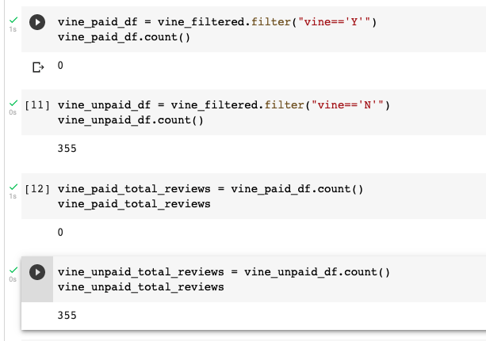
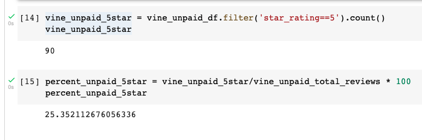

# Amazon_Vine_Analysis
## Overview
### In this project we analyzed Amazon reviews written by members of the paid Amazon Vine program. The Amazon Vine program is a service that allows manufacturers and publishers to receive reviews for their products. Companies like SellBy pay a small fee to Amazon and provide products to Amazon Vine members, who are then required to publish a review.

### We picked the gift card review dataset and used PySpark to perform the ETL process to extract the dataset, transform the data, connect to an AWS RDS instance, and load the transformed data into pgAdmin. Next, we used PySpark to determine if there is any bias toward favorable reviews from Vine members in this dataset. 

## Deliverable 1
### We created an AWS RDS database with tables in pgAdmin, pick the gift card review dataset from the Amazon Review datasets and extracted the dataset into a DataFrame. We then transformed the DataFrame into four separate DataFrames that match the table schema in pgAdmin. Then, we uploaded the transformed data into the appropriate tables and ran queries in pgAdmin to confirm that the data has been uploaded.

## Deliverable 2
### Paid reviews, non-paid reviews, total paid reviews which is zero and total unpaid reviews.

### Here we have the unpaid 5 star ratings and the percentage unpaid of 5 star ratings. The precentage paid 5 star reviews is zero because our total paid reviews is zero.

## Summary
#### Only 25% were 5 star ratings in the unpaid category. There is not enough evidence to prove bias as our paid member count for 5 star rating is 0.
### Additional analysis:
#### We can do a statistical hypothesis testing. 
#### 1. The null hypothesis is the one we intend to reject. An alternative hypothesis will rival the null hypothesis.
#### 2. We choose the appropriate statistical test and the statistical significance level for hypothesis testing.
#### 3. We perform the statistical test on the data.
#### 4. We either accept or reject the null hypothesis based on whether the data exceeds the predetermined significance level using a predetermined statistical test.

